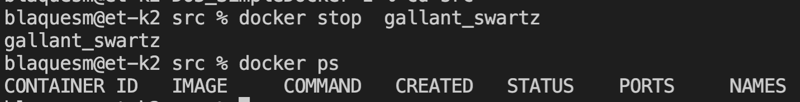

## Part 1. Готовый докер  
#### 1) Взять официальный докер образ с nginx и выкачать его при помощи docker pull  
* `  docker pull nginx`  

  

#### 2) Проверить наличие докер образа через docker images  
* `  docker images`  

  

#### 3-4) Запустить докер образ через `docker run -d [image_id|repository]` и проверить что образ запустился через `docker ps`  
* `  docker run -d 448a08f1d2f9` проверяем, что образ запустился с помощью команды `  docker ps`  

  

#### 5) Посмотреть информацию о контейнере через `docker inspect [container_id|container_name]`  
* `  docker inspect bold_carver`  

  

#### 6) По выводу команды определить и поместить в отчёт размер контейнера, список замапленных портов и ip контейнера  
* с помощью команы `  docker inspect bold_carver --size | grep -i SizeRw`  

  

*  ` docker inspect bold_carver` список портов: 

  

*  ip контейнера `  docker inspect bold_carver --size | grep -i ip`  

  

Флаг `--size` здесь необязателен.

#### 7-8) Остановить докер образ через `docker stop [container_id|container_name]` и проверить, что образ остановился через `docker ps`  
* используем команду `  docker stop bold_carver` и проверяем остановку командой `  docker ps`  

  

#### 9) Запустить докер с замапленными портами 80 и 443 на локальную машину через команду `run`  
* вводим `  docker run -d -p 80:80 -p 443:443 nginx`  проверим запуск командой `  docker ps`  

  

#### 10) Проверить, что в браузере по адресу localhost:80 доступна стартовая страница nginx  
* Открываем любой браузер и в адресной строке пишем localhost:80  

  

#### 11-12) Перезапустить докер контейнер через `docker restart [container_id|container_name]` и проверить любым способом, что контейнер запустился  
* перезапуск контейнера командой `  docker restart gallant_swartz` проверим  командой `  docker ps`  

  

## Part 2. Операции с контейнером  
#### 1) Прочитать конфигурационный файл nginx.conf внутри докер контейнера через команду `exec`  
* используем команду ` docker exec gallant_swartz cat /etc/nginx/nginx.conf`  

  

#### 2) Создать на локальной машине файл nginx.conf  

  

#### 3) Настроить в нем по пути /status отдачу страницы статуса сервера nginx  
* дописываем блок http  

  

 для отработки страницы потребовалось закомментировать 
 `include /etc/nginx/conf.d/*.conf`   

#### 4-5) Скопировать созданный файл nginx.conf внутрь докер образа через команду `docker cp` и Перезапустить nginx внутри докер образа через команду `exec`  
* копируем файл командой ` docker cp nginx.conf gallant_swartz:etc/nginx/` и перезапускаем nginx командой ` docker exec gallant_swartz nginx -s reload`  

  

#### 6) Проверить, что по адресу localhost:80/status отдается страничка со статусом сервера nginx    

  

#### 7) Экспортировать контейнер в файл container.tar через команду export  
` docker export -o contein.tar gallant_swartz  `

  

#### 8) Остановить контейнер  
* командой ` docker stop gallant_swartz`  

  

#### 9) Удалить образ через `docker rmi [image_id|repository]`, не удаляя перед этим контейнеры  
* удаляем образ командой ` docker rmi -f nginx`  

  

#### 10) Удалить остановленный контейнер  
* удаляем контейнер командой ` docker rm gallant_swartz`  

  

#### 11) Импортировать контейнер обратно через команду import  
* ` docker import -c 'CMD ["nginx", "-g", "daemon off;"]' cnt.tar test`  

  

#### 12) Запустить импортированный контейнер  
* ` docker run -d -p 80:80 -p 443:443 test`  

  

#### 13) Проверить, что по адресу localhost:80/status отдается страничка со статусом сервера nginx  
  
