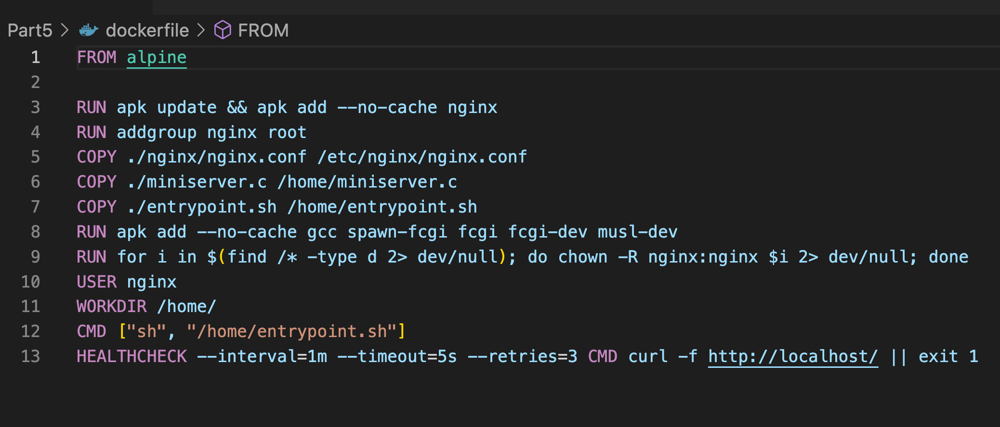

## Part 3. Мини веб-сервер  
* Пишем мини сервер на C и FastCgi, с возвращающим значением `Hello World!`  
  

* Для проксировки запросов с 81 порта на 127.0.0.1:8080 пишем свой nginx.conf 
  

* Скачаем образ nginx, затем запускаем контейнер, после копируем c файл сервера и conf файл nginx  
  

* Входим в контейнер `docker exec -it friendly_keldysh bash`, после успешного входа обновляем репозитории, далее устанавливаем gcc, spawn-fcgi и libfcgi-dev  
  

* Компилируем и запускаем сервер  
  

* проверяем в браузере   
 

## Part 4. Свой докер  
* Создаём докерфайл  
  

* Создаём скрипт, выполняющий роль entrypoint  
  

* Собираем образ указав имя и тег `docker build`
  

* `docker images`, собралось корректно  
  

* для последующего маппинга перенесем из образа папку nginx 
   

* Запускаем собранный докер образ 
  

* проверяем в браузере  
  

* Дописываем в ./nginx/nginx.conf проксирование странички /status 
  

* Перезапускаем докер образ, смотрим браузер  

  

  

  

## Part 5. Dockle  
* установим доклю  

* проверим образ  
  

* C ошибкой CIS-DI-0010 можно было разобраться только сменой образа на Alpine
* переписываем докерфайл  
  

* Ошибки устранены
  

## Part 6. Базовый Docker Compose  
*  Для второго контейнера перепишем скрипт entrypoint, иначе он будет завершать работу после `docker-compose up`  
  

* Для проксирования   _**nginx.conf**_ перепишем
  

* создадим **_docker-compose.yml_**  
  

* затем ` docker-compose build` собираем
  

* запускаем командой `docker-compose up`
  

* проверяем в браузере

  
  